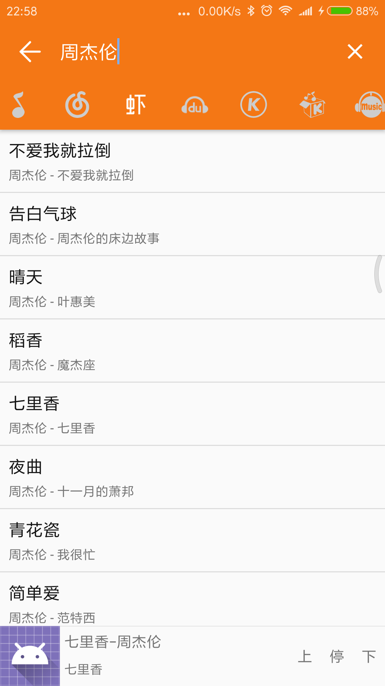
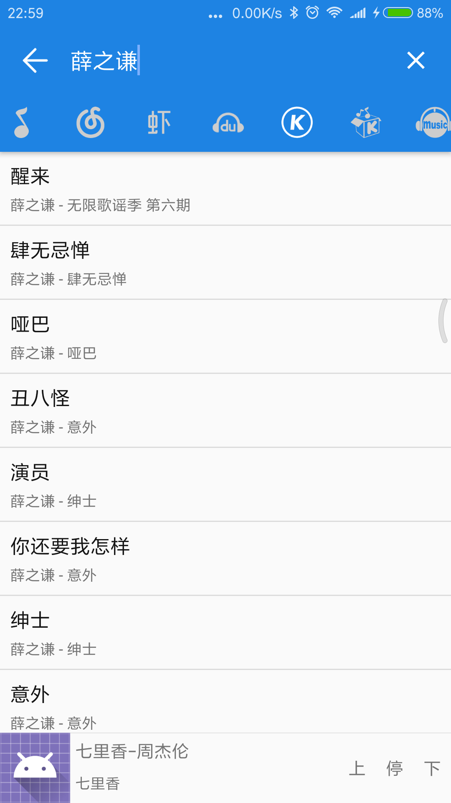
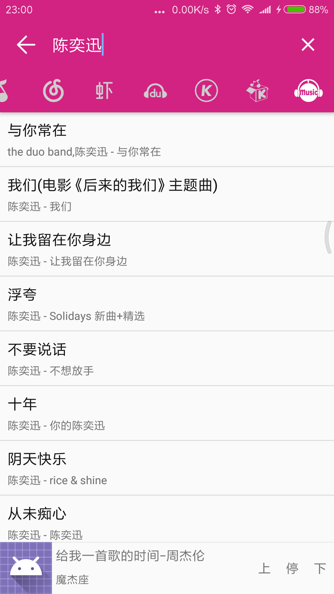

# Music
纯音乐

- 播放器来自
-[MusicLibrary](https://github.com/lizixian18/MusicLibrary)

- http工具类，来自
-[khttp](https://github.com/jkcclemens/khttp)

- 音乐解析来自,项目中用到的是我改过的kotlin版本
-[music](https://github.com/maicong/music)

# 支持网站
- [x] 百度音乐
- [x] QQ音乐
- [x] 虾米音乐
- [x] 网易云音乐
- [x] 酷狗音乐
- [x] 酷我音乐
- [x] 咪咕音乐

# 截图

